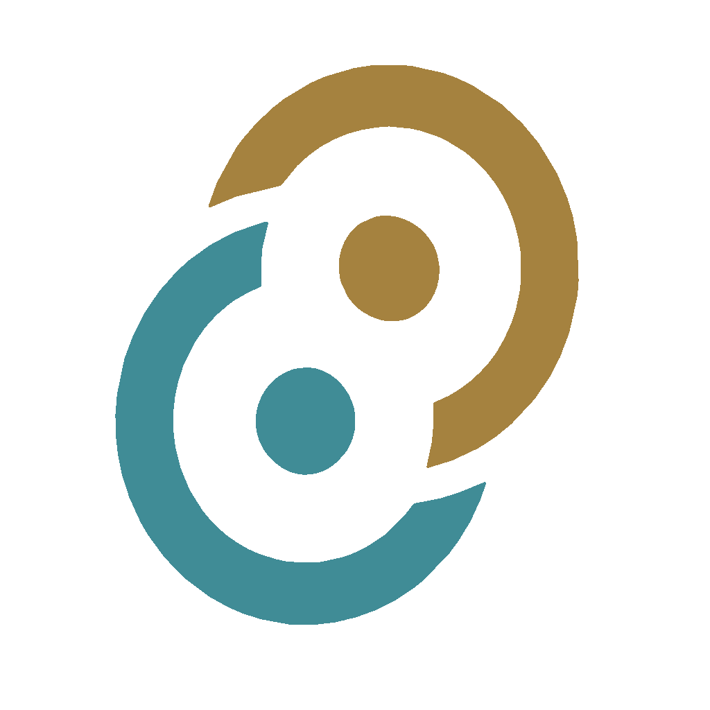

# Concord — Brand

**Tagline:** Mesh Comms System



The Concord brand mark is **two interlocking rings** — a "linked
peers" symbol with a small solid node dot offset toward the centre
of each ring. Two nodes joined at peer level, no hierarchy.

The artwork ships as **two grayscale-alpha mask PNGs**, one per
ring. The application paints each half at runtime by combining the
mask with a theme-driven background colour (CSS `mask-image` +
`background-color`). Switching theme retints the logo without
touching the asset.

## Files

| Path                                           | Purpose                                    |
|------------------------------------------------|--------------------------------------------|
| `branding/logo-upper.png`                      | **Master mask, upper-right ring + node.** 1024×1024 LA, binary alpha. |
| `branding/logo-lower.png`                      | **Master mask, lower-left ring + node.** 1024×1024 LA, binary alpha. |
| `branding/generate_favicons.py`                | Regenerates web favicons + the composited reference `logo.png`. |
| `branding/generate_tauri_icons.py`             | Regenerates desktop + mobile Tauri icons (composites the halves at the default tint). |
| `client/public/logo-upper.png`                 | Runtime asset — used by `<ConcordLogo />` and the index.html splash via `mask-image`. |
| `client/public/logo-lower.png`                 | Runtime asset — paired with `logo-upper.png`. |
| `client/public/logo.png`                       | Composited reference at default-theme tint. Generated artefact, not an editable source. |
| `client/src/components/brand/ConcordLogo.tsx`  | React component that renders the mark with two CSS-variable-tinted half overlays. |

## Rendering strategy

The mark is drawn **two ways**:

1. **Mask-tinted halves** (in-app, theme-responsive). The React
   `<ConcordLogo />` component and the pre-React `#boot-splash`
   layer in `client/index.html` both use the same mechanism: two
   absolutely-positioned divs, each with `mask-image` set to one
   of the half PNGs and `background-color` set to a CSS custom
   property (`--color-logo-primary` for the upper, `--color-logo-secondary`
   for the lower). Theme switches retint the mark instantly with
   no asset reload.

2. **Default-tinted composites** (OS chrome). Favicons, the apple-touch
   icon, Windows tile icons, the macOS .icns, and the iOS AppIconset
   all live outside the in-app theme cascade, so we composite the
   two halves with a fixed default tint at generation time. The
   default tint is the **bronze + teal** palette — see the
   constants `TINT_PRIMARY` and `TINT_SECONDARY` in
   `branding/generate_favicons.py`.

## Regenerating after a master edit

```bash
python3 branding/generate_favicons.py      # web favicons
python3 branding/generate_tauri_icons.py   # desktop + iOS icons
```

iOS AppIcon assets are composited onto a solid white background at
generation time because Apple forbids transparent iOS app icons.
The masks stay transparent so future re-themes can be done by
editing the colour constants and re-running both scripts.

## Glyph

Two interlocking rings — a "link" or "peering" symbol. The two
nodes join without either being above the other: flat, peer-to-peer,
no hierarchy. Each ring has a small solid inner dot offset toward
the opposite side, suggesting the nodes making contact across the
link.

## In-app default tint (Bronze Teal)

| Role                       | Hex        | Use                                     |
|----------------------------|------------|-----------------------------------------|
| `--color-logo-primary`     | `#a5823f`  | Upper-right ring + node                 |
| `--color-logo-secondary`   | `#408c96`  | Lower-left  ring + node                 |

These are **defaults**. The React component and CSS expose
overrides (`--color-logo-primary` / `--color-logo-secondary` per-
theme; `primaryColor` / `secondaryColor` per-instance) so theme
swatches and previews can render the mark in alternate palettes.

## Authoring new mask halves

When producing a replacement asset:

1. Render the mark as a **single-colour silhouette** on transparent
   alpha. Luminance can be 100% white (the application discards it
   anyway and uses only the alpha channel).
2. Output **two files**: `logo-upper.png` (whatever appears on top of
   the chain weave at the centre crossing) and `logo-lower.png`
   (whatever passes underneath).
3. Use a **square canvas** of at least 1024×1024 so the OS-icon
   pipeline has enough resolution for retina displays.
4. Drop both files into `branding/` then copy them to
   `client/public/`. Re-run both generator scripts.
